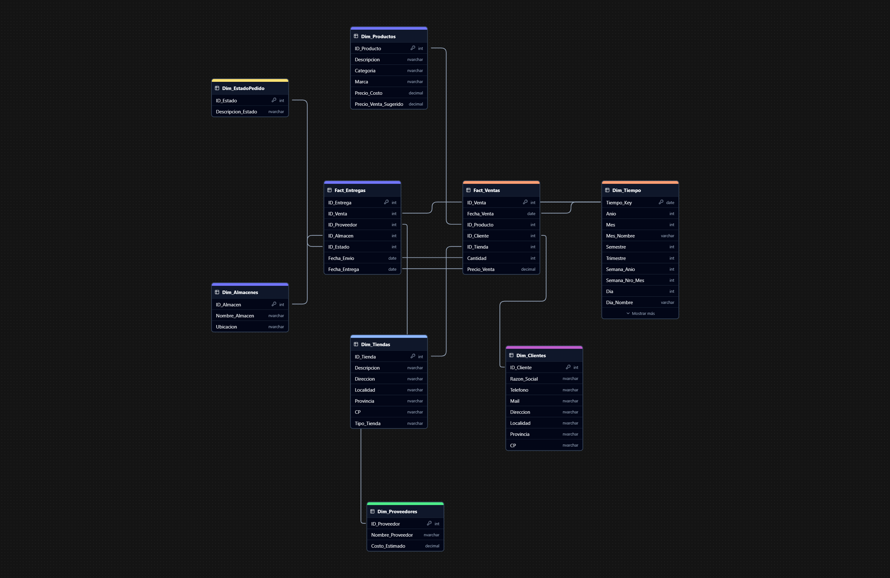

# Proyecto: Data Warehouse para DataShop

Este proyecto implementa un **Data Warehouse (DW)** para la empresa **DataShop**, utilizando herramientas como **SQL Server** y **Python** para manejar y transformar datos provenientes de diferentes fuentes.
## Modelo Lógico de Datos

### Dimensiones
- **Dim_Clientes**
- **Dim_Tiendas**
- **Dim_Productos**
- **Dim_Proveedores**
- **Dim_Almacenes**
- **Dim_EstadoPedido**
- **Dim_Tiempo**

### Hechos
- **Fact_Ventas**
- **Fact_Entregas**

## Imagen del Modelo Físico


## Tabla de Contenidos

- [Descripción del Proyecto](#descripción-del-proyecto)
- [Estructura del Proyecto](#estructura-del-proyecto)
- [Flujo de Trabajo](#flujo-de-trabajo)
- [Requisitos](#requisitos)
- [Implementación](#implementación)
  - [ETL](#etl)
  - [Stored Procedures](#stored-procedures)
  - [Carga de Tablas Dimensionales y de Hechos](#carga-de-tablas-dimensionales-y-de-hechos)
- [Instrucciones de Uso](#instrucciones-de-uso)
- [Estructura del Data Warehouse](#estructura-del-data-warehouse)

## Descripción del Proyecto

Este proyecto permite la construcción de un **Data Warehouse** desde datos en formato **CSV**. Se divide en las siguientes etapas:

1. **Extracción**: Carga de datos desde archivos CSV.
2. **Transformación**: Limpieza y normalización de datos en tablas `stg` (staging).
3. **Carga**: Inserción de datos procesados en tablas `int` (intermedias) y finalmente en tablas `dim` (dimensiones) y `fact` (hechos).

## Estructura del Proyecto
DW_DataShop/
Esquema de Data Warehouse en SQL Server:

Dimensiones 
Tabla de Hechos
Scripts en Python:

Se desarrollaron scripts en Python para cargar los datos desde archivos CSV a las tablas de SQL Server. Los scripts permiten transformar y limpiar los datos antes de su carga en las tablas correspondientes del Data Warehouse.
Reportes en Power BI:

Se diseñaron y crearon visualizaciones en Power BI, incluyendo KPIs y gráficos interactivos que permiten explorar el rendimiento de ventas por tienda, producto, cliente y período.
## Flujo de Trabajo

1. **ETL a Tablas Staging (`stg`)**:
   - Se extraen datos desde archivos CSV utilizando Python.
   - Los datos se limpian y transforman según las necesidades del negocio.

2. **Carga a Tablas Intermedias (`int`)**:
   - Los datos limpios de las tablas `stg` se procesan y cargan a tablas intermedias utilizando stored procedures.

3. **Carga de Tablas Dimensionales (`dim`)**:
   - Las dimensiones como `Clientes`, `Productos`, etc., se generan a partir de las tablas `int`.

4. **Carga de Tablas de Hechos (`fact`)**:
   - Se construyen las tablas `Fact_Ventas` y `Fact_Entregas` a partir de las dimensiones y las tablas `int`.

5. **Generación de la Dimensión de Tiempo (`Dim_Tiempo`)**:
   - Un stored procedure genera esta tabla basada en el año especificado.

## Requisitos

- **SQL Server**
- **Python 3.11** o superior
- Librerías Python:
  - `pandas`
  - `pyodbc`

## Implementación

### ETL

Los scripts ETL se encuentran en la carpeta `etl_scripts/` y procesan los datos en el siguiente orden:

1. **Staging (`stg`)**:
   - Cada script carga un archivo CSV en su respectiva tabla `stg`.
2. **Intermedias (`int`)**:
   - Se ejecutan stored procedures para procesar y cargar los datos en las tablas `int`.

### Stored Procedures

- **Carga Dimensional**: 
  - Stored procedures como `sp_carga_Dim_Clientes` y `sp_carga_Dim_Productos` procesan datos desde `int` hacia `dim`.
- **Carga de Hechos**:
  - `sp_carga_Fact_Ventas` y `sp_carga_Fact_Entregas` combinan las dimensiones y datos intermedios para generar las tablas de hechos.

### Carga de Tablas Dimensionales y de Hechos

Cargar stg: Scripts como etl_carga_stg_clientes.py para cargar cada tabla staging.
Cargar dim y fact: carga_dim_fact.py para ejecutar los SP relacionados.
SP generales: etl_carga_sp.py para ejecutar todos los stored procedures de forma modular.
Script principal: main_etl.py para orquestar todo el flujo.

## Instrucciones de Uso

1. **Clonar el Repositorio**:
   ```bash
   git clone https://github.com/franjimenxz/integrador-qualesgroup.git
   cd DataShop-DW-QualesGroup
